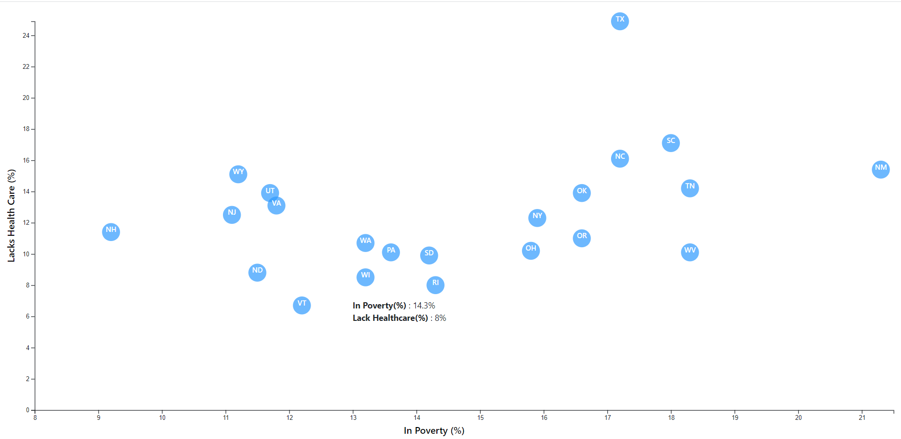

# D3-Challenge
This assignment involved creating a graph using d3, and appaending an SVG to html.

The scatter plot depicts percentage in Povertry against percentage of people lacking health care.

Each Data point represents a state, and the insersection of these two parameters (Each states abbreviation indicated as labels for each data point). 

